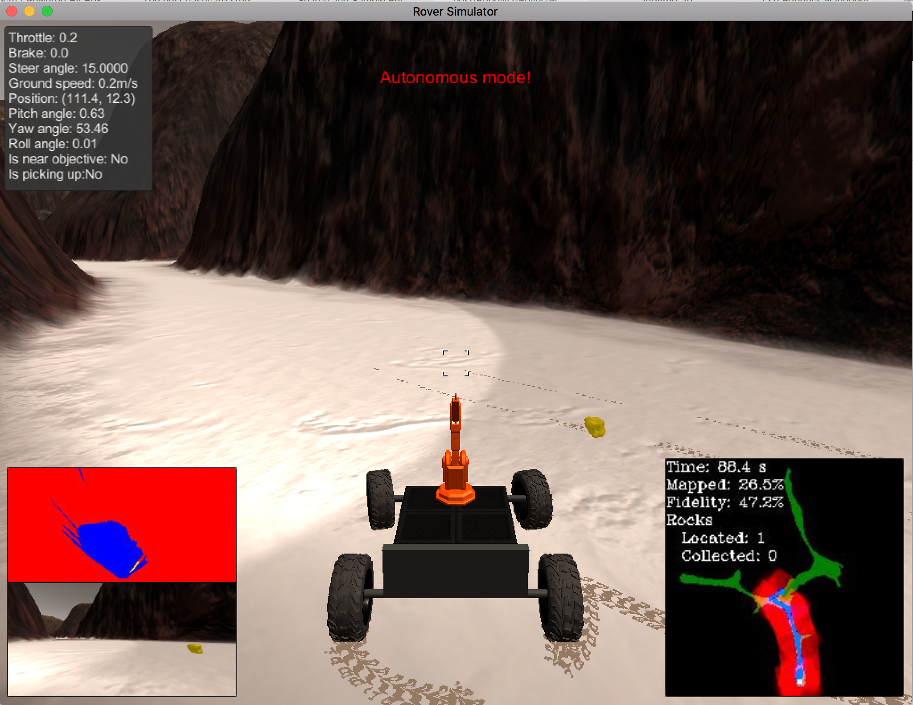

## Project: Search and Sample Return
### Writeup / README

#### 1. Provide a Writeup / README that includes all the rubric points and how you addressed each one.  You can submit your writeup as markdown or pdf.

Hi, the project was fun and rewarding, many thanks. (explanations were not always clear -- but it's hard, I know).

### Notebook Analysis
#### 1. Run the functions provided in the notebook on test images (first with the test data provided, next on data you have recorded). Add/modify functions to allow for color selection of obstacles and rock samples.
My notebook contains examples of color detection of obstacles and rock samples.

Additionally, I could check during autonomous mode that they operate correctly

#### 1. Populate the `process_image()` function with the appropriate analysis steps to map pixels identifying navigable terrain, obstacles and rock samples into a worldmap.  Run `process_image()` on your test data using the `moviepy` functions provided to create video output of your result.
I could do this with not much trouble. Some unit tests would be helpful, but I guess we do not have them IRL ;)

### Autonomous Navigation and Mapping

#### 1. Fill in the `perception_step()` (at the bottom of the `perception.py` script) and `decision_step()` (in `decision.py`) functions in the autonomous mapping scripts and an explanation is provided in the writeup of how and why these functions were modified as they were.
Not much trouble to adapt the `process_image()` code to this function and compute distances in rover-centric coordinates.

#### 2. Launching in autonomous mode your rover can navigate and map autonomously.  Explain your results and how you might improve them in your writeup.

**Note: running the simulator with different choices of resolution and graphics quality may produce different results, particularly on different machines!  Make a note of your simulator settings (resolution and graphics quality set on launch) and frames per second (FPS output to terminal by `drive_rover.py`) in your writeup when you submit the project so your reviewer can reproduce your results.**

My Rover Sim configuration is

The FPS was about 41fps on my mac.

**Suggested improvements for my code**:

- The Rover navigates the whole map in an opportunistic fashion: it goes wherever it sees fit, sometimes going through already discovered areas, which make it long to discover all the rocks. So adding a better navigation algoritm would allow it to navigate the whole map much faster (easy saying!)
- Work on picking rocks:
  - use the detected rock mask to slow down and navigate to a detected rock
  - infer actions to position the rover in front of the rock until the 'near rock' flag is set to True
  - pick it
